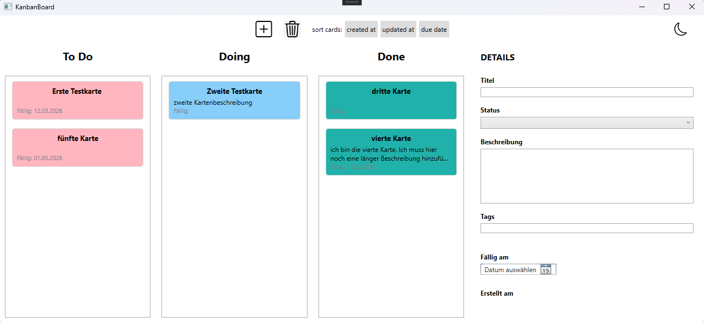

# Kanban Board (WPF Desktop App)

Ein einfaches Kanban-Board als Desktop-Anwendung, entwickelt mit C# und WPF.

Das Projekt dient dazu, grundlegende Konzepte der Anwendungsentwicklung zu üben,
z. B. Benutzeroberflächen, Datenstruktur, MVVM Architektur, Zustandsverwaltung und Unit tests.

## Funktionen

- Karten erstellen und löschen
- Details einer Karte ändern (Titel, Status, Beschreibung, Fälligkeitsdatum)
- MVVM Architektur
- Repository Pattern für Datenpersistenz

## Projektstruktur

Das Projekt ist in mehrere Schichten unterteilt:

- **App** → WPF UI, ViewModels and Commands
- **Core**  → Domain models and repository interfaces
- **Infrastructure** → Data persistence implementations
- **Tests** → Unit tests für zentrale Funktionen
  
## Technologien

- C#
- .NET 8
- WPF

## Geplante Erweiterungen

- Beschreibung für Karten
- Tags / Labels
- Lokale Datenspeicherung (z. B. JSON oder SQLite)
- UI und Bedienbarkeit verbessern
- Kanban Layout (ToDo / Doing / Done)
- Drag & Drop Bedienung
