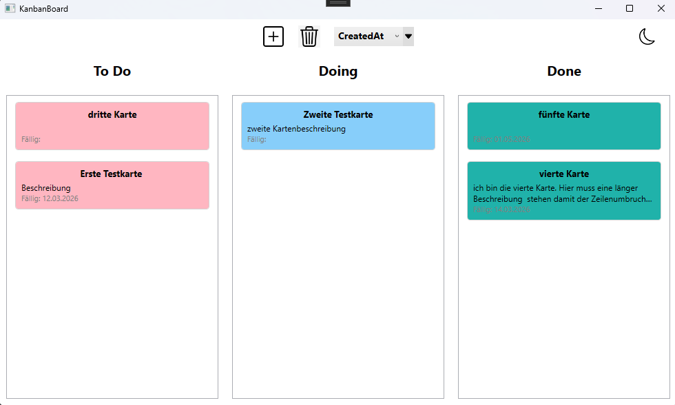
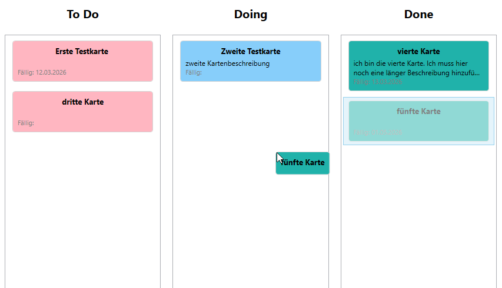

# Kanban Board (WPF Desktop App)

Eine Desktop-Kanban-Anwendung, entwickelt mit C#, .NET 8 und WPF.

Das Projekt dient dazu, zentrale Konzepte moderner Desktop-Anwendungsentwicklung praktisch umzusetzen – darunter MVVM, Datenpersistenz mit SQLite, Repository Pattern, Zustandsverwaltung, Drag & Drop sowie eine anpassbare Benutzeroberfläche mit Light- und Dark-Theme.

## Funktionen

- Karten erstellen und löschen
- Details einer Karte ändern (Titel, Status, Beschreibung, Fälligkeitsdatum)
- MVVM Architektur
- Repository Pattern für Datenpersistenz
- Beschreibung für Karten erstellbar
- Tags können Karten hinzugefügt werden
- Lokale Datenspeicherung (in JSON)
- Kanban Layout (ToDo / Doing / Done)
- Drag & Drop Bedienung der Karten
- Menübar für aktuelle und neue Buttons
- seperates Fenster zur Bearbeitung von Karten
- Sortierung der Karten in den Spalten nach CreatedAt / UpdatedAt / DueDate

## Projektstruktur

Das Projekt ist in mehrere Schichten unterteilt:

- **App** → WPF UI, ViewModels and Commands
- **Core**  → Domain models and repository interfaces
- **Infrastructure** → Data persistence implementations
- **Tests** → Unit tests für zentrale Funktionen
  
## Technologien

- C#
- .NET 8
- WPF

## Geplante Erweiterungen / Updates
   
- UI
  - Darkmode
  - Hover-Effekte für Karten + Cursor Änderung
  - Spalten bei DragOver hervorheben

 
 

#### Hinweis
Icons by Bootstrap Icons
 
https://icons.getbootstrap.com/
