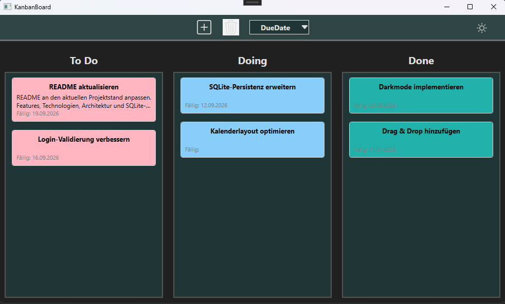
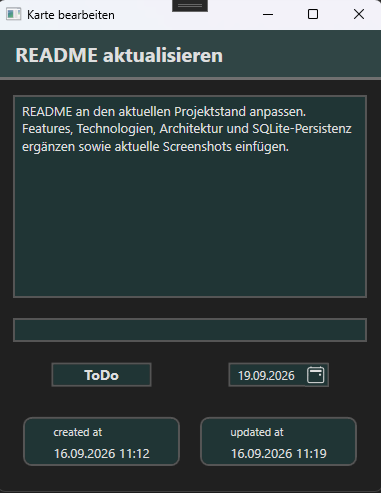
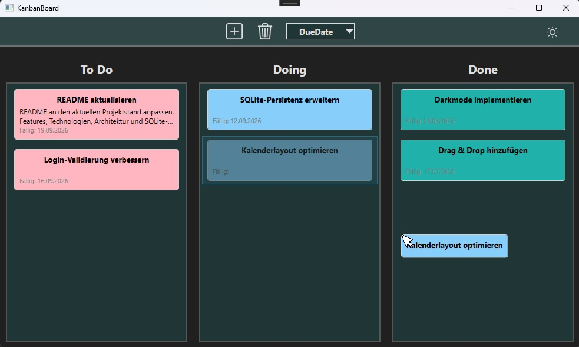
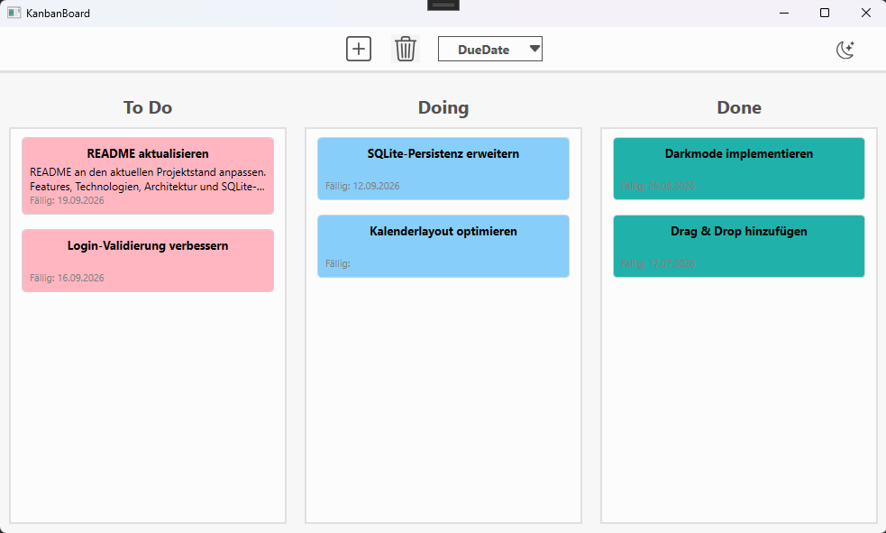

# Kanban Board (WPF Desktop App)

Eine Desktop-Kanban-Anwendung, entwickelt mit C#, .NET 8 und WPF.

Das Projekt dient dazu, zentrale Konzepte moderner Desktop-Anwendungsentwicklung praktisch umzusetzen – darunter MVVM, Datenpersistenz mit SQLite, Repository Pattern, Zustandsverwaltung, Drag & Drop sowie eine anpassbare Benutzeroberfläche mit Light- und Dark-Theme.

## Features

- Karten erstellen, bearbeiten und löschen
- Karten zwischen **To Do**, **Doing** und **Done** verschieben
- Drag & Drop mit visueller Vorschau
- Kartendetails bearbeiten:
  - Titel
  - Status
  - Beschreibung
  - Fälligkeitsdatum
- Karten nach `CreatedAt`, `UpdatedAt` oder `DueDate` sortieren
- Automatisches Speichern von Änderungen
- Light- und Dark-Theme mit gespeicherter Theme-Auswahl
- Separates Bearbeitungsfenster für Karten

## Technologien

- **C# / .NET 8** – Anwendungslogik
- **WPF** – Desktop-Oberfläche
- **SQLite / Microsoft.Data.Sqlite** – lokale Persistenz der Board-Daten
- **System.Text.Json** – Speicherung von Anwendungseinstellungen und Migration bestehender JSON-Daten
- **Git / GitHub** – Versionsverwaltung

## Architektur & Projektstruktur

Das Projekt ist in mehrere Bereiche aufgeteilt, um Benutzeroberfläche, Anwendungslogik und Datenpersistenz voneinander zu trennen.

- **KanbanBoard.App** – WPF-Oberfläche, ViewModels, Commands und Theme-Verwaltung
- **KanbanBoard.Core** – zentrale Modelle, Enums und Interfaces
- **KanbanBoard.Infrastructure** – Implementierungen für Datenpersistenz und Migration

Verwendete Architektur- und Designkonzepte:

- MVVM-orientierte Trennung von UI und Logik
- Repository Pattern über `IBoardRepository`
- Dependency Injection über Konstruktoren
- `INotifyPropertyChanged` für Datenbindung und UI-Aktualisierung

## Persistenz

Die Board-Daten werden lokal in einer SQLite-Datenbank gespeichert.  
Die Persistenz ist über das `IBoardRepository` vom restlichen Anwendungscode entkoppelt.

- **SQLite** für Karten- und Board-Daten
- **JSON** für Anwendungseinstellungen
- Automatische Migration bestehender JSON-Boarddaten nach SQLite
- Persistenzzugriffe über Repository-Implementierungen

Beim Start der Anwendung wird geprüft, ob bereits SQLite-Daten vorhanden sind. Falls nicht, werden vorhandene Board-Daten aus der vorherigen JSON-Persistenz automatisch einmalig nach SQLite migriert.

## Bedienung / Screenshots

### Kanban-Board

Das Board ist in die Bereiche **To Do**, **Doing** und **Done** aufgeteilt.
Karten können erstellt, bearbeitet, sortiert und zwischen den Spalten verschoben werden.

### Karte bearbeiten

Über ein separates Bearbeitungsfenster können Titel, Status, Beschreibung und Fälligkeitsdatum einer Karte angepasst werden.

### Drag & Drop

Karten können per Drag & Drop zwischen den einzelnen Status-Spalten verschoben werden.
Während des Verschiebens wird die Zielposition visuell hervorgehoben.

### Light-Theme

Neben dem Dark-Theme steht auch ein Light-Theme zur Verfügung.
Die gewählte Darstellung wird in den Anwendungseinstellungen gespeichert.

## Projektstatus / Roadmap

Der aktuelle Stand umfasst die zentralen Funktionen des Kanban-Boards inklusive Drag & Drop, Themes, Sortierung, Autosave und lokaler SQLite-Persistenz.

Geplante Weiterentwicklungen:

- Datenbankzugriffe auf gezielte `INSERT`-, `UPDATE`- und `DELETE`-Operationen umstellen
- Tags funktional erweitern, z. B. für Filterung oder Suche
- Unit-Tests für zentrale Logik ergänzen
- Weitere kleinere UI- und UX-Verbesserungen

## Lizenz / Icons

- Lizenz: MIT
- Icons: [Bootstrap Icons](https://icons.getbootstrap.com/)
